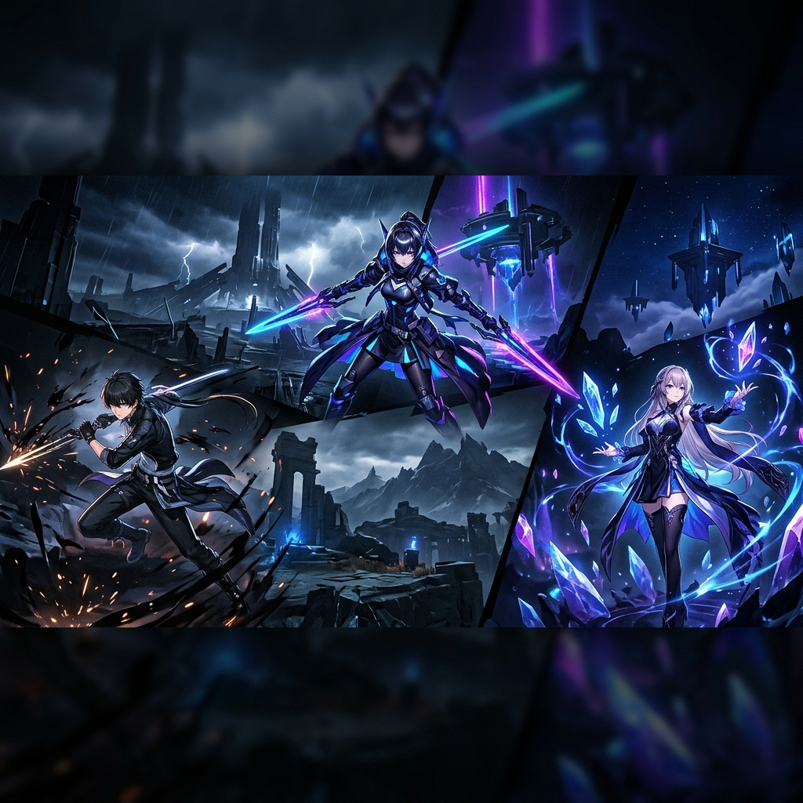

# ⚡ Veve Game Services - Professional Game Boosting

<div align="center">
  
  
  <p align="center">
    <strong>Layanan Jasa Joki Game Terpercaya, 100% Manual, Aman, dan Cepat.</strong>
  </p>

  <p align="center">
    <a href="https://vevego.github.io/joki-veve/"><strong>Explore Website »</strong></a>
    <br />
    <br />
    <a href="#-features">Features</a> ·
    <a href="#-tech-stack">Tech Stack</a> ·
    <a href="#-installation">Installation</a> ·
    <a href="#-contact">Contact</a>
  </p>
</div>

---

## 🚀 Overview

**Veve Game Services** adalah platform jasa joki game profesional yang fokus pada keamanan akun dan kepuasan pelanggan. Dibangun dengan fokus pada performa dan estetika gaming yang premium.

### 🎮 Supported Games
- **Arknights: Endfield** (Maintenance, Exploration, Event)
- **Wuthering Waves** (Map 100%, Echo Farming, Daily)
- **Neverness To Everness** (Urban Exploration, Story Clear)

---

## ✨ Features

- 📱 **Fully Responsive** - Tampilan sempurna di Desktop, Tablet, maupun HP.
- ⚡ **SPA Navigation** - Transisi halaman halus tanpa reload berkat custom router.
- 📊 **Dynamic Statistics** - Angka order dan client otomatis tersinkronisasi dengan data testimoni.
- 🎨 **Premium Aesthetics** - Desain dark-mode dengan efek Glassmorphism dan background animasi dinamis.
- ⭐ **Testimonial System** - Grid testimoni interaktif dengan fitur Lightbox untuk melihat bukti transaksi.
- 💬 **Direct Integration** - Terhubung langsung ke Discord untuk pemesanan cepat.

---

## 🛠 Tech Stack

- **Frontend**: HTML5, Vanilla CSS3, Modern JavaScript (ES6+)
- **Icons**: Font Awesome 6.4
- **Fonts**: Google Fonts (Inter & Outfit)
- **Animation**: Custom Canvas API Background
- **Deployment**: GitHub Pages

---

## 📂 Project Structure

```text
joki-page/
├── assets/             # Assets (Logo, Icons, Testimonials)
├── background-animation.js # Logika animasi canvas background
├── index.css           # Desain sistem & responsivitas
├── index.html          # Halaman Utama
├── orders.js           # Logika sinkronisasi statistik
├── router.js           # Custom SPA Router logic
├── testimoni.html      # Halaman List Testimoni
└── testimonials.js     # Database testimoni (JSON-like)
```

---

## ⚙️ Installation

1. **Clone the repository**
   ```bash
   git clone https://github.com/venkyarisko/joki-page.git
   ```

2. **Open in browser**
   Cukup buka `index.html` menggunakan browser favoritmu. 
   *Note: Disarankan menggunakan **Live Server** (VS Code) untuk mengaktifkan fitur transisi SPA.*

---

## 🤝 Contact & Socials

Dapatkan update terbaru atau mulai pemesanan kamu di sini:

- **Discord**: [vevego](https://discord.com/users/vevego)
- **GitHub**: [@venkyarisko](https://github.com/venkyarisko)

---

<div align="center">
  <p>Built with 💙 by Veve Services</p>
  <p>&copy; 2026 Veve Game Services. All rights reserved.</p>
</div>
